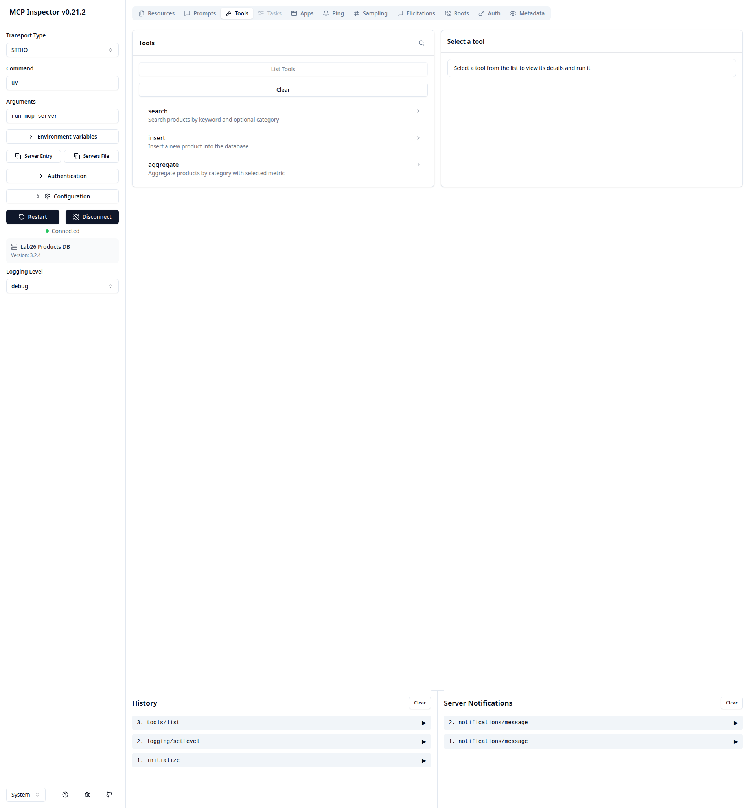
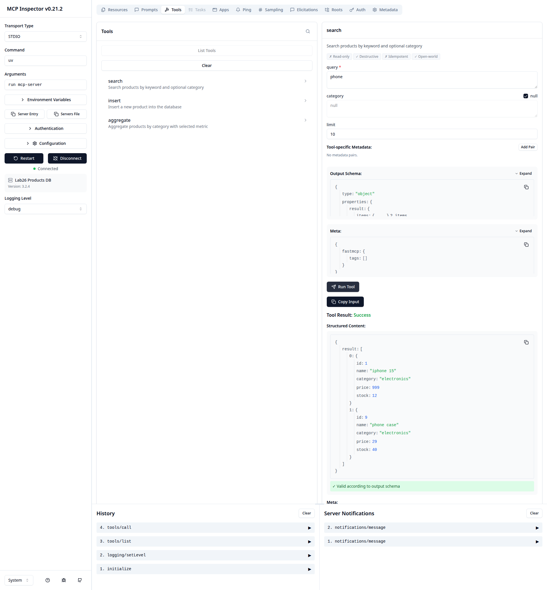
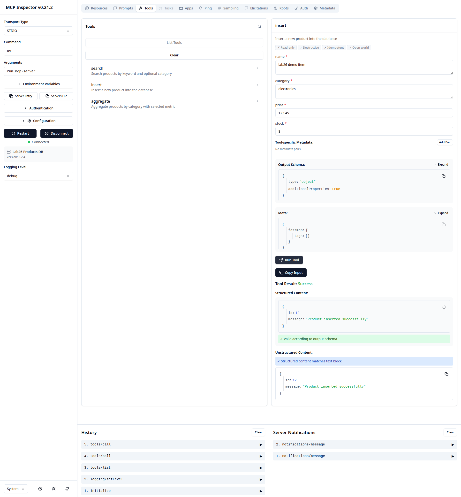
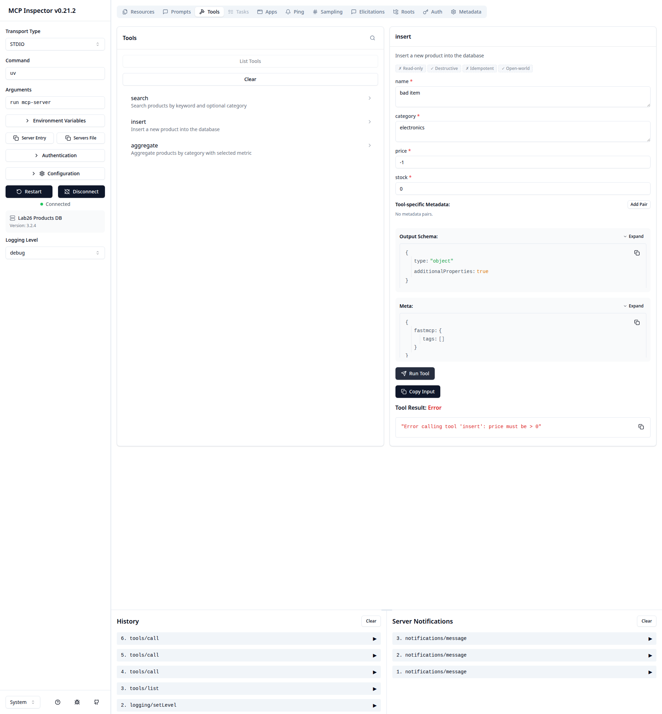
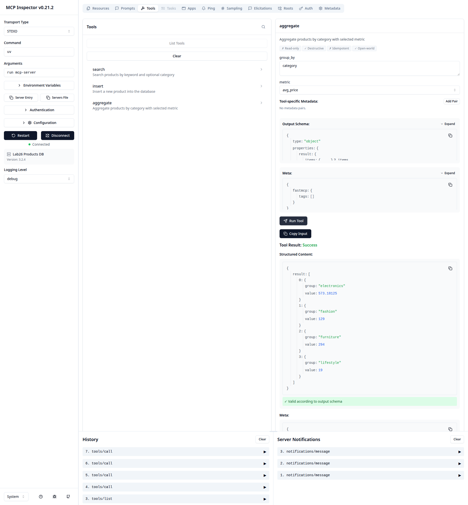
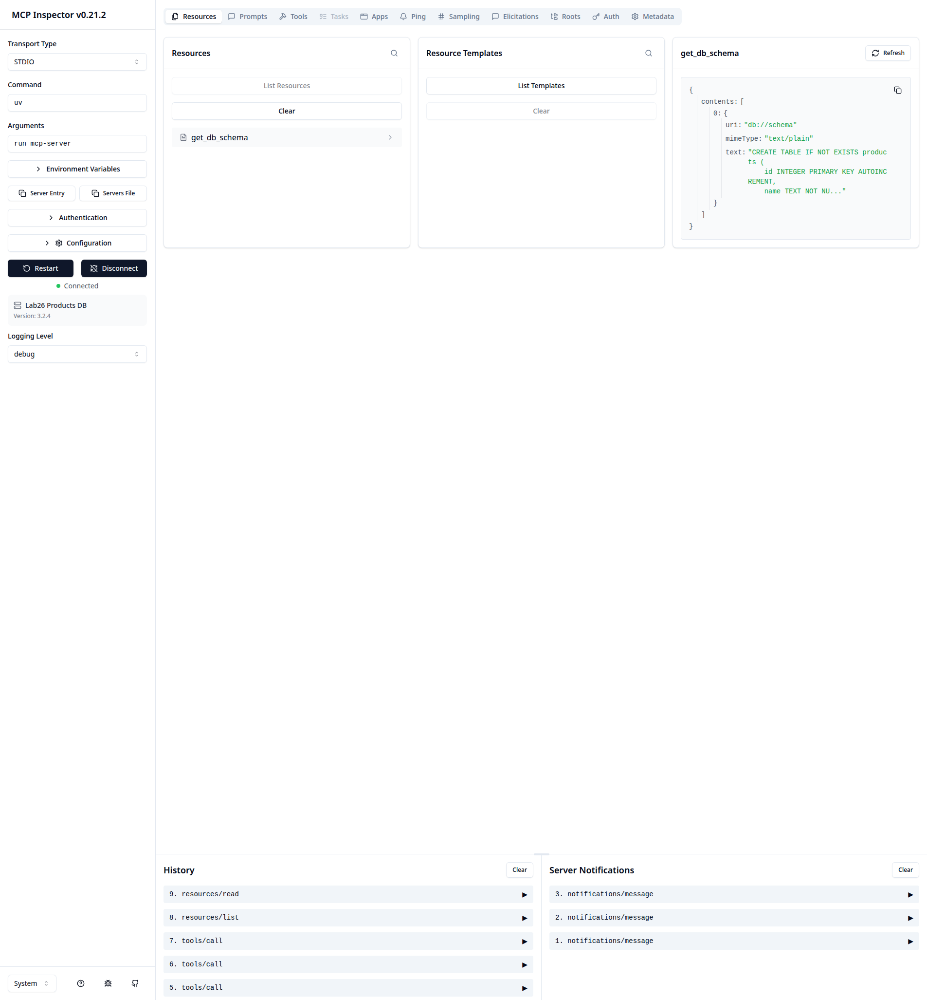

# Lab 26 - Build MCP Server (Products DB)

## 1) Project Description

This project implements an MCP (Model Context Protocol) server using FastMCP + Python + uv.
The server exposes:
- 3 tools: `search`, `insert`, `aggregate`
- 1 resource: `db://schema`

Database: local SQLite (`data/lab26.db`).

## 2) Setup and Run

```bash
git clone <your-repo-url>
cd Lab26-Build-MCP-Server_2A202600417-PhamMinhKhang
make install
make run
```

Useful commands:

```bash
make test
make inspect
make run-sse
make run-sse-auth
```

## 3) Tools and Resource

| Name | Type | Input | Output |
|---|---|---|---|
| `search` | tool | `query: str`, `category: str | None`, `limit: int = 10` | `list[dict]` |
| `insert` | tool | `name: str`, `category: str`, `price: float (>0)`, `stock: int (>=0)` | `{ "id": int, "message": str }` |
| `aggregate` | tool | `group_by: "category"`, `metric: "count" \| "total_stock" \| "avg_price"` | `list[{"group", "value"}]` |
| `db://schema` | resource | none | SQL schema string |

## 4) MCP Inspector Screenshots

Captured screenshots in `screenshots/`:
- `01-tool-list.png`
- `02-search-schema-result.png`
- `03-insert-success.png`
- `04-insert-error.png`
- `05-aggregate-result.png`
- `06-resource-schema.png`

Preview:








How to reproduce:

```bash
make inspect
```

## 5) Claude Desktop Config

Scope note: Claude Desktop E2E is intentionally skipped per latest requirement.
If needed later, you can still use this config snippet:

```json
{
  "mcpServers": {
    "lab26-products": {
      "command": "uv",
      "args": [
        "run",
        "--project",
        "/absolute/path/to/Lab26-Build-MCP-Server_2A202600417-PhamMinhKhang",
        "mcp-server"
      ]
    }
  }
}
```

## 6) Demo Video (2 minutes)

Scope note: demo video is intentionally skipped per latest requirement.

## 7) Bonus: SSE Auth

Run SSE mode:

```bash
make run-sse
```

Run SSE with API key guard:

```bash
MCP_API_KEY=secret123 make run-sse-auth
```

Auth behavior:
- Missing or invalid `Authorization: Bearer <token>` -> `401 Unauthorized`
- Valid bearer token -> SSE endpoint is accessible
